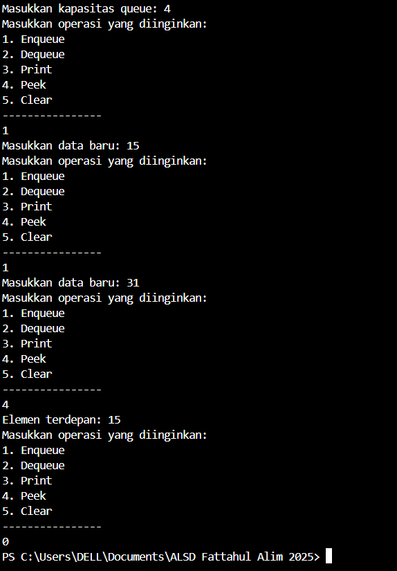
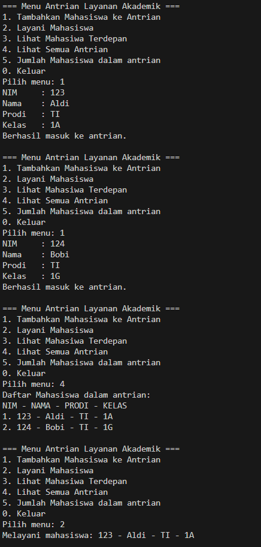
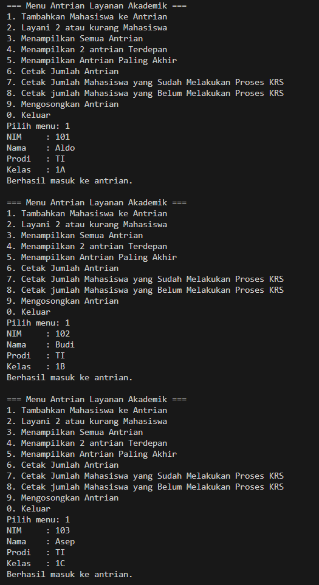

|  | Algoritma dan Struktur Data|
|--|--|
| NIM |  244107020018|
| Nama |  Muhammad Fattahul Alim |
| Kelas | TI - 1H |
| Repository |https://github.com/FattahulAlim/ALSD-Fattahul-Alim-2025|

# Jobsheet 11 Queue

## 2.1 Percobaan 1 : Operasi Dasar Queue

Hasil Praktikum :

---

### 2.1.3. Pertanyaan 
1. Pada konstruktor, mengapa nilai awal atribut front dan rear bernilai -1, sementara atribut size 
bernilai 0?

    Jawaban : Karena disaat array belum diisi maka array akan kosong jika kita memberikan nilai front dan rear di indeks 0 maka seolah olah array telah memiliki nilai pada indeks ke 0 padahal belum maka dari itu diberikan nilai -1 pada front dan rear untuk menunjukkan bahwa array masih kosong karena array tidak memiliki indeks ke -1. sementara size menunjukkan jumlah indeks array yang telah diisi atau tidak bernilai null / 0.

2. Pada method Enqueue, jelaskan maksud dan kegunaan dari potongan kode berikut! 

        if (rear == max - 1) {
            rear = 0;
            } 

    Jawaban : Apabila rear bernilai (panjang array - 1) maka akan mengubah nilai rear menjadi 0 karena array masih belum penuh namun indeks yang dapat diisi terdapat pada indeks awal yaitu 0 dan hingga ke-n, sehingga kita perlu untuk mengubah nilai rear menjadi 0 agar kita dapat mengisi array kosong yang terdapat pada indeks awal

3. Pada method Dequeue, jelaskan maksud dan kegunaan dari potongan kode berikut!

        if (front == max - 1) {
            front = 0;
            } 

    Jawaban : Apabila front bernilai (panjang array - 1) maka akan mengubah nilai front menjadi 0 karena array masih belum sepenuhnya kosong, masih ada data yang dapat kita dequeue tapi indeks front telah mencapai indeks terakhirs sementara data yang dapat di dequeue terletak pada indeks awal array (indeks ke-0 hingga ke-n) maka kita perlu merubah nilai front menjadi 0 agar kita dapat mengakses data pada array indeks ke-0 dan seterusnya.

4. Pada method print, mengapa pada proses perulangan variabel i tidak dimulai dari 0 (int i=0), 
melainkan int i=front? 

    Jawaban : Karena konsep queue adalah mengharuskan kita untuk mengakses data dengan urutan input paling awal (first in, first out), maka dari itu i = front karena kita harus mengakses data berdasarkan urutan paling awal diinput. Jika kita menggunakan nilai i = 0, bisa saja data yang telah diinputkan paling awal berada pada indeks ke-n dan bukan ke-0 hal ini mengakibatkan akses data yang tidak sesuai dan tidak beraturan.

5. Perhatikan kembali method print, jelaskan maksud dari potongan kode berikut! 

        i = (i + 1) % max;

    Jawaban : Potongan kode diatas digunakan untuk mengakses keseluruhan indeks array secara otomatis dan berurutan, selain itu kode diatas dapat digunakan untuk mengubah nilai i menjadi 0 secara otomatis jika i telah menacapai nilai maksimal indeks array (max - 1) tetapi masih ada data dalam array yang belum diakses

6. Tunjukkan potongan kode program yang merupakan queue overflow! 

    Jawaban :     

        if (isFull()) {
        System.out.println("Queue sudah penuh");
        }  

7. Pada saat terjadi queue overflow dan queue underflow, program tersebut tetap dapat berjalan 
dan hanya menampilkan teks informasi. Lakukan modifikasi program sehingga pada saat terjadi 
queue overflow dan queue underflow, program dihentikan!

    Jawaban : 

            public void Enqueue(int dt) {
        if (isFull()) {
            System.out.println("Queue sudah penuh");
            System.exit(0);
        } else {
            if (isEmpty()) {
                front = rear = 0;
            } else {
                if (rear == max - 1) {
                    rear = 0;
                } else {
                    rear++;
                }
            } 
            data[rear] = dt;
            size++;
        }
    }

            public int Dequeue(){
        int dt = 0;
        if (isEmpty()) {
            System.out.println("Queue masih kosong");
            System.exit(0);
        } else {
            dt = data[front];
            size--;
            if (isEmpty()) {
                front = rear = -1;
            } else {
                if (front == max - 1) {
                    front = 0;
                } else {
                    front++;
                }
            }
        } 
        return dt;
    }

## 2.2 Percobaan 2 : Antrian Layanan Akademik

Hasil Praktikum :
---

---
.png)
---

### 2.2.3 Pertanyaan
Lakukan modifikasi program dengan menambahkan method baru bernama LihatAkhir pada class
AntrianLayanan yang digunakan untuk mengecek antrian yang berada di posisi belakang. Tambahkan
pula daftar menu 6. Cek Antrian paling belakang pada class LayananAkademikSIAKAD sehingga
method LihatAkhir dapat dipanggil!

Modifikasi kode program: 

                public void lihatTerakhir(){
        if (isEmpty()) {
            System.out.println("Antrian kosong");
        } else {
            System.out.println("Mahasiswa terdepan: ");
            System.out.println("NIM - NAMA - PRODI - KELAS");
            data[rear].tampilkanData();
        }

Hasil Output :
---
.png)

## 2.3 Tugas

Hasil Output:
---

---
.png)
---
.png)
---
.png)

Diagram Class :
---
.png)
---
.png)
---

