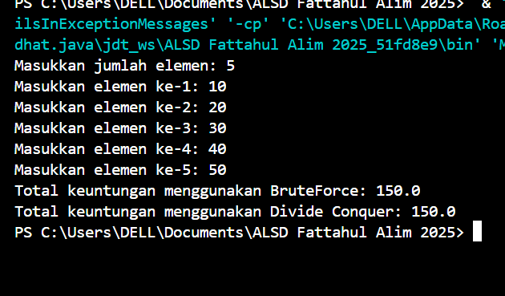

|  | Algoritma dan Struktur Data|
|--|--|
| NIM |  244107020018|
| Nama |  Muhammad Fattahul Alim |
| Kelas | TI - 1H |
| Repository |https://github.com/FattahulAlim/ALSD-Fattahul-Alim-2025|

# Jobsheet 5 Brute Force dan Divide Conquer

## 5.2 Menghitung Nilai Faktorial dengan Brute Force dan Divide Conquer

---

### 5.2.3 Pertanyaan

1. Baris kode if merupakan base case yaitu kondisi dasar yang akan menyebabkan pemanggilan rekursi berhenti. Sementara baris kode else merupakan kode untuk melakukan rekursi secara terus menerus hingga berhenti pada base case, sekaligus melakukan operasi faktorial.

2. Ya, mungkin saja untuk menggunakan perulangan selain for pada method faktorialBF() berikut perubahan kode serta hasil outputnya

.png)
---

3. fakto *= i adalah proses mengalikan digit angka satu persatu dari awal hingga perulangan berhenti. 

    Sementara fakto = n * faktorialDC(n-1); adalah proses rekursi untuk memecah masalah faktorial tersebut menjadi beberapa bagian kecil dan disaat sudah mencapai base case maka solusi untuk tiap bagian masalah tersebut akan digabungkan sehingga menjadi satu solusi final.
4. faktorialBF() bekerja dengan cara melakukan perkalian satu persatu dari awal hingga perulangan berhenti setelah itu hasil dari perkalian tersebut menjadi solusi.

    faktorialDC() bekerja dangan cara memecah suatu masalah besar menjadi beberapa bagian kecil nantinya bagian bagian yang sudah dipecah tersebut diberi solusi, solusi dari setiap bagian kecil tadi akan digabungkan sehingga menjadi solusi secara keseluruhan.

## 5.3 Menghitung Hasil Pangkat 

---

### 5.3.3 Pertanyaan 

1. Pada fungsi pangkatBF() dilakukan perhitungan pangkat secara satu persatu dengan perulangan sementara fungsi pangkatDC() dilakukan perhitungan pangkat dengan membagi masalah perhitungan menjadi beberapa bagian kecil lalu memberikan solusi ke bagian kecil tersebut dan yang terakhir menggabungkan semua solusi menjadi solusi keseluruhan.

2. Tahap combine sudah termasuk dalam fungsiDC() pada bagian 

        return (pangkatDC(a, n/2) * pangkatDC(a, n/2) * a);  
        return (pangkatDC(a, n/2) * pangkatDC(a, n/2));      

3. Ya, mungkin saja jika tidak menggunakan parameter maka program akan menjadi seperti ini

.png)
---

4. Kesimpulan dari cara kerja kedua fungsi tersebut yaitu, fungsi pangkatBF() dilakukan perhitungan pangkat secara satu persatu dengan perulangan sementara fungsi pangkatDC() dilakukan perhitungan pangkat dengan membagi masalah perhitungan menjadi beberapa bagian kecil lalu memberikan solusi ke bagian kecil tersebut dan yang terakhir menggabungkan semua solusi menjadi solusi keseluruhan.

## 5.4  Menghitung Sum Array

---

### 5.4.3 Pertanyaan

1. Variabel mid dibutuhkan untuk membagi array menjadi bagian bagian kecil, contoh yang awalnya panjangnya 6 dibagi menjadi 3 dan 3 itu adalah fungsi dari variabel mid. Nantinya jika sudah mencapai base case maka semua angka yang telah terbagi dalam beberapa bagian kecil akan diberi solusi lalu setiap solusi akan digabungkan hingg menjadi solusi keseluruhan

2. Statement : 

        double lsum = totalDC(arr, l, mid);
        double rsum = totalDC(arr, mid+1, r);

    Statement diatas digunakan untuk memanggil fungsi secara rekursif dan nantinya akan disimpan di dua bagian yaitu lsum untuk menghitung total keuntungan bagian kiri array dan rsum digunakan untuk menghitunng total keuntungan bagian kanan array setelah itu keduanya nanti akan dijumlahkan setelah mencapai base case

3. Statement : 
        
        return lsum + rsum

    Statement diatas digunakan untuk memastikan bahwa hasil dari dua bagian array (bagian kiri dan bagian kanan) digabung kembali untuk mendapatkan total keseluruhan.
    
4. Base case totalDC() adalah disaat variabel l bernilai sama dengan variabel r setelah itu akan mengembalikan nilai array[l]

5. totalDC() bekerja dengan cara membagi array menjadi dua bagian yaitu kiri dan kanan. Fungsi akan terus rekursif hingga mencapai base case setelah itu setiap bagian akan dijumlahkan hingga mencapai jumlah total keseluruhan
    

## 4.5 Latihan Praktikum

---

---

---

