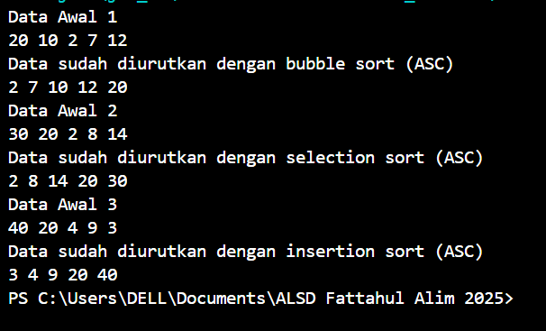

|  | Algoritma dan Struktur Data|
|--|--|
| NIM |  244107020018|
| Nama |  Muhammad Fattahul Alim |
| Kelas | TI - 1H |
| Repository |https://github.com/FattahulAlim/ALSD-Fattahul-Alim-2025|

# P6 Jobsheet Sorting (Bubble, selection, dan insertion sort)

## 5.2 Mengimplementasikan sorting menggunakan object

Hasil Praktikum :

---

### 5.2.5 Pertanyaan 
1. Kode program :

             if (data[j-1] > data[j]) {
                    temp = data[j];
                    data[j] = data[j-1];
                    data[j-1] = temp;
                }
    
    Kode program diatas digunakan untuk membandingkan nilai data(j - 1) dengan nilai data(j) dengan j sebagai indeks jika nilai pada data(j - 1) lebih besar maka akan terjadi pertukaran posisi. data(j) akan disimpan pada variabel temp sebagai tempat penyimpanan sementara kemudian data(j) nilainya diganti dengan nilai pada data(j-1) dan data(j-1) nilainya diganti dengan nilai pada variabel temp.

2. Berikut kode untuk mencari nilai minimum pada selection sort :

            for(int j = i+1; j < jumData; j++){
                if (data[j] < data[min]) {
                    min = j;
                }
            }

3. Baris kode program :

        while (j >= 0 && data[j] > temp )

    j > = 0 adalah untuk memastikan bahwa perulangan tidak berjalan melebihi indeks array
    sementara data[j] > temp adalah untuk membandingkan apakah data[j] nilainya lebih besar dari temp jika iya nantinya data[j] perlu digeser ke kanan agar nilai temp dapat disisipkan.

4. Baris kode program: 

        data[j+1] = data[j];

    Baris kode diatas fungsinya untuk menggeser nilai data yang lebih besar agar nantinya dapat disisipkan nilai yang lebih kecil pada indeks tersebut

## 5.3 Praktikum sorting menggunakan array of object

Hasil praktikum :

---
.png)
---

### 5.3.4 Pertanyaan 
1. Baris kode program:

            for(int i = 0; i < listMhs.length - 1; i++){
            for(int j = 1; j < listMhs.length - i; j++){

    A. Karena dalam satu perulangan penuh nilai yang terbesar akan otomatis berpindah ke posisi akhir array maka dari itu kita tidak hanya perlu membandingkan sejumlah (array.length - 1) kali

    B. Kondisi listMhs.length - i digunakan untuk menghindari perbandingan yang tidak diperlukan karena elemen terbesar sudah pasti berada pada posisi yang tepat sehingga kita dapat mengurangi jumlah perbandingannya

    C. Jika terdapat 50 data dalam array listMhs maka perulangan i akan berulang selama 49 kali sementara tahap bubble sort akan terus mengalami pengurangan iterasi yang awalnya 49 menjadi 48, 47, 46 dan terus berkurang hingga perulangan berhenti

2. Merubah kode program :

.png)
---
.png)
---

Hasil running : 

.png)
---
.png)
---
.png)

## 5.3.5 Mengurutkan Data Mahasiswa Berdasarkan IPK (Selection Sort) 

Hasil praktikum : 

---

### 5.3.7 Pertanyaan

1. Baris kode program :

            int idxMin = i;
            for(int j = i+1; j < listMhs.length; j++){
                if (listMhs[j].ipk < listMhs[idxMin].ipk) {
                    idxMin = j;
                }
            }

    Baris pertama dilakukan untuk menyimpan index nilai yang dianggap terkecil untuk sementara setelah itu program akan masuk kedalam perulangan dengan nilai j = i+1 dan menghentikan perulangan saat nilai j sama dengan nilai panjang array. Selanjutnya kode akan melakukan pengecekan apakah ada nilai yang lebih kecil dari listMhs[idxMin] jika ada nilai variabel idxMin akan diganti dengan nilai index saat ini, setelah itu melanjutkan perulangan hingga perulangan berhenti

## 5.4 Mengurutkan Data Mahasiswa Berdasarkan IPK Menggunakan Insertion Sort 

Hasil praktikum : 

---

### 5.4.3 Pertanyaan

1. Mengubah kode program menjadi insertion sort secara descending:

.png)
---

Hasil Running :
.png)
---

## 5.5 Latihan praktikum

Hasil Latihan :

---
.png)
---
.png)
---
.png)
---
.png)
---
.png)
---
.png)
---

