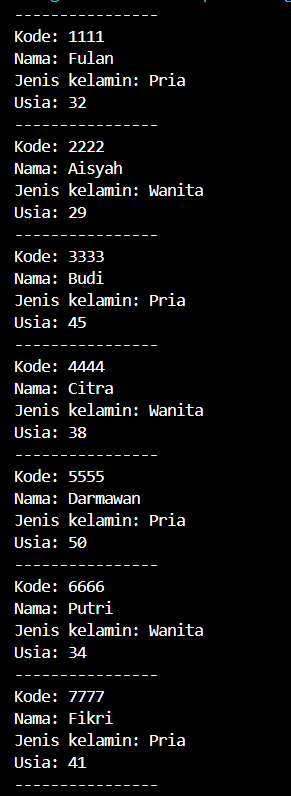

|  | Algoritma dan Struktur Data|
|--|--|
| NIM |  244107020018|
| Nama |  Muhammad Fattahul Alim |
| Kelas | TI - 1H |
| Repository |https://github.com/FattahulAlim/ALSD-Fattahul-Alim-2025|

# P7 JOBSHEET VI SEARCHING

## 6.2 Searching / Pencarian Menggunakan Agoritma Sequential Search

Hasil Praktikum :
.png)
---
.png)
---
.png)
---

### 6.2.3 Pertanyaan
1. Method tampilDataSearch digunakan untuk menampilkan data mahasiswa yang memiliki ipk sama dengan yang dicari. Sementara method tampilPosisi hanya menampilkan index dimana data mahasiswa yang dicari disimpan.

2. Kode program :

            if (listMhs[j].ipk == cari) {
                posisi = j;
                break;
            }

    Fungsi break pada baris kode diatas digunakan untuk menghentikan perulangan jika data yang dicari telah ditemukan

## 6.3 Searching / Pencarian Menggunakan Binary Search

Hasil Praktikum :
.png)
---

### 6.3.3 Pertanyaan

1. Proses Divide:

            } else if (listMhs[mid].ipk > cari) {
                return findBinarySearch(cari, left, mid-1);
            } else{
                return findBinarySearch(cari, mid+1, right);
            }

2. Proses Conquer:

            if (cari == listMhs[mid].ipk) {
                return mid;
            }

3. Program akan tetap berjalan namun hasil yang diberikan oleh program tidak akan akurat karena cara kerja binary search adalah membandingkan nilai di tengah dengan nilai yang dicari nantinya program akan bergerak ke data di kanan (nilai yang lebih besar) atau kiri (nilai yang lebih kecil) sesuai perbandingan yang telah dijalankan.

4. Kode program yang diubah :

            } else if (listMhs[mid].ipk < cari) {
                return findBinarySearch(cari, left, mid-1);
            } else{
                return findBinarySearch(cari, mid+1, right);

Hasil Percobaan :
.png)

5. Kode program telah sesuai dengan pertanyaan dimana dapat menentukan jumlah mahasiswa melalui inputan

Kode program class main :

        public static void main(String[] args) {
        Scanner sc = new Scanner(System.in);
        

        System.out.print("Input jumlah mahasiswa: ");
        int jmlh = sc.nextInt();
        sc.nextLine();

        MahasiswaBerprestasi16 list = new MahasiswaBerprestasi16(jmlh);

        for(int i = 0; i < jmlh; i++){
            System.out.println("-------------------------");
            System.out.println("Data mahasiswa ke-" + (i+1));

            System.out.print("Input nim: ");
            String nim = sc.nextLine();
            System.out.print("Input nama: ");
            String nama = sc.nextLine();
            System.out.print("Input kelas: ");
            String kelas = sc.nextLine();
            System.out.print("Input ipk: ");
            double ipk = sc.nextDouble();
            sc.nextLine();

            Mahasiswa16 mhs = new Mahasiswa16(nim, nama, kelas, ipk);
            list.tambah(mhs);
        }

Kode program class MahasiswaBerprestasi16

public class MahasiswaBerprestasi16 {
    Mahasiswa16[] listMhs;
    int idx;

    public MahasiswaBerprestasi16(int jmlh) {
        listMhs = new Mahasiswa16[jmlh];
    }

    void tambah(Mahasiswa16 m){
        
        if (idx < listMhs.length) {
            listMhs[idx] = m;
            idx++;
        } else {
            System.out.println("data sudah penuh");
        }
    }

## 6.5 Latihan Praktikum

Hasil Praktikum :

---
.png)
---
.png)
---
.png)
---

