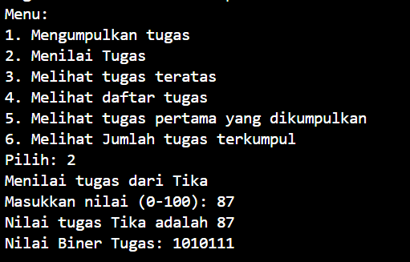

|  | Algoritma dan Struktur Data|
|--|--|
| NIM |  244107020018|
| Nama |  Muhammad Fattahul Alim |
| Kelas | TI - 1H |
| Repository |https://github.com/FattahulAlim/ALSD-Fattahul-Alim-2025|

# Jobsheet 10 Stack

## 2.1 Percobaan 1: Mahasiswa Mengumpulkan Tugas

Hasil Praktikum :

---
.jpeg)
---

### 2.1.3 Pertanyaan

1. Melakukan perbaikan agar hasil output dapat sesuai dengan jobsheet
.png)
---
Hasil Output
.png)

2. Data tugas yang dapat ditampung didalam stack tergantung jumlah parameter yang kita inputkan saat memanggil konstruktor dari fungsi main. Namun karena saat ini parameter berisikan nilai 5 maka tugas yang dapat ditampung dalam stack berjumlah 5

Kode program di class StackTugasMahasiswa.java

        public StackTugasMahasiswa16(int size){
        this.size = size;
        stack = new Mahasiswa16[size];
        top = -1;
    }

Kode program di MahasiswaDemo16.java

        StackTugasMahasiswa16 stack = new StackTugasMahasiswa16(5);

3. Pengecekan kondisi !isFull pada method push digunakan agar tidak ada error yang terjadi karena index out of bound. Jika if-else kondisi tersebut dihapus maka akan dapat menyebabkan error index out of bound karena kita memasukkan nilai ke array dengan index yang lebih besar sama dengan panjang array

4. Perubahan kode program di class StackTugasMahasiswa16

        public Mahasiswa16 peekTugasPertama() {
        if (!isEmpty()) {
            return stack[0];
        } else {
            System.out.println("Belum ada tugas terkumpul");
            return null;
        }
    }

Perubahan kode program di class MahasiswaDemo16

    case 5: 
            Mahasiswa16 lihatPertama = stack.peekTugasPertama();
            if (lihatPertama != null) {
                System.out.println(lihatPertama.nama + " Orang pertama yang mengumpulkan tugas");
            }
            break;

Hasil Output :
.png)
---

5. Menambahkan method pada StackTugasMahasiswa16 

        public int jumlahTugas() {
        return top + 1;
    }

Menambahkan menu pada class MahasiswaDemo16

    case 6:
            int jumlah = stack.jumlahTugas();
            System.out.println("Jumlah tugas yang telah terkumpul: " + jumlah);
            break;

Hasil output
.png)

## Percobaan 2: Konversi Nilai Tugas ke Biner 

Hasil Praktikum :

### 2.2.3 Pertanyaan

1. Pertama kita membuat object baru dengan nama stack yang akan digunakan untuk menyimpan sisa pembagian, melakukan perulangan untuk membagi nilai tugas dengan 2 nantinya sisa pembagian akan disimpan pada stack sisa pembagian sisa itulah yang kita sebut biner, perulangan akan berhenti jika nilai tugas sudah mencapai angka 0. Selanjutnya kita membuat variabel dengan tipe data string untuk menyimpan angka binernya, melakukan perulangan hingga kondisi stack kosong, melakukan pop pada stack untuk menyimpan tiap nilai biner di string baru yang telah kita buat, terakhir menjadikan nilai yang ada dalam string sebagai nilai kembalian karena pada string tersebut telah menyimpan nilai biner yang tadi kita konversi.
2. Program akan tetap berjalan sebagaimana mestinya karena nilai tugas akan terus dibagi 2 hingga nilai tugas bernilai 0 disaat itulah perulangan akan berhenti. Nilai tugas juga sudah pasti akan berhenti di angka 0 dikarenakan sistem yang akan otomatis melakukan pembulatan kebawah jika tipe data yang disimpan merupakan tipe data dengan jenis integer.

## 2.4 Latihan Praktikum

Hasil Praktikum

---
.png)
---

