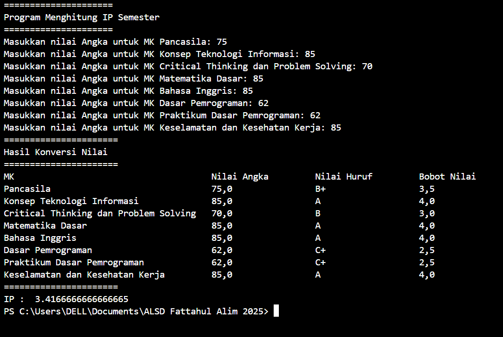
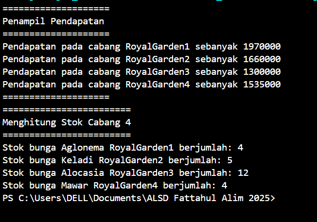

|  | Algoritma dan Struktur Data|
|--|--|
| NIM |  244107020018|
| Nama |  Muhammad Fattahul Alim |
| Kelas | TI - 1H |
| Repository |https://github.com/FattahulAlim/ALSD-Fattahul-Alim-2025|

# Jobsheet 1 (Konsep Dasar Pemrograman)

## 2.2.1 Praktikum Pemilihan

Praktikum ini diimplementasikan pada file pemilihan.java, dibawah ini merupakan tangkapan layar dari hasil implementasi

.png)
---
---
.png)

**Penjelasan Singkat:** Terdapat 4 langkah utama dalam program : 
1. Pengguna melakukan input nilai
2. Melakukan pemeriksaan nilai apakah telah sesuai dalam rentang 0-100
3. Menghitung serta melakukan konversi nilai
4. Menentukan hasil akhir apakah mahasiswa lulus atau tidak

## 2.3.1 Praktikum Perulangan

Praktikum ini diimplementasikan pada file perulangan.java, dibawah ini merupakan tangkapan layar dari hasil implementasi

.png)
---
---
.png)

**Penjelasan Singkat:** Terdapat 7 langkah utama dalam program : 
1. Input NIM
2. Menyimpan 2 digit terakhir NIM pada 2 variabel berbeda
3. Menggabungkan 2 digit tersebut pada satu variabel
4. Konversi tipe data dari String ke integer
5. Melakukan pengecekan apakah digit tersebut kurang dari 10 jika iya dijumlahkan 10 
6. Melakukan pengecekan ketentuan didalam perulangan 
7. Menampilkan hasil output perulangan sesuai dengan ketentuan yang ada

## 2.4.1 Praktikum Array

Praktikum ini diimplementasikan pada file Array.java, dibawah ini merupakan tangkapan layar dari hasil implementasi

---

**Penjelasan Singkat:** Terdapat 4 langkah utama dalam program : 
1. Melakukan input nilai
2. Melakukan pengecekan kondisi untuk menentukan nilai huruf serta bobot nilai pengguna
3. Menghitung serta melakukan konversi nilai
4. Menampilkan hasil laporan pengguna

## 2.5.1 Praktikum Fungsi

Praktikum ini diimplementasikan pada file fungsi.java, dibawah ini merupakan tangkapan layar dari hasil implementasi

---

**Penjelasan Singkat:** Terdapat 5 langkah utama dalam program : 
1. Inisialisasi Array
2. Memanggil fungsi pendapatan
3. Pada fungsi pendapatan nantiya akan menghitung pendapatan pada tiap cabang dan menampilkan hasilnya
4. Memanggil fungsi jumlahStok
5. Pada fungsi jumlahStok nantinya akan menghitung stok bunga padang cabang 4 yang telah berkurang karena terdapat bunga yang mati serta menampilkan hasilnya

## Tugas

### Tugas No. 1

Praktikum ini diimplementasikan pada file Tugas1.java, dibawah ini merupakan tangkapan layar dari hasil implementasi

.png)
---
---
.png)

**Penjelasan Singkat:** Terdapat 5 langkah utama dalam program : 
1. Inisialisasi Array
2. Input kode plat mana yang ingin dicari oleh pengguna
3. Melakukan Search apakah kode plat ada didalam array yang telah diinisialisasi
4. Melakukan pengecekan jika tidak ada menampilkan output "Plat Tidak Ditemukan"
5. Jika plat ada dalam array maka akan menjumlahkan seluruh huruf yang terpisah pada array kota kemudian menyimpan hasil penjumlahan pada array hasil dan menampilkan outputnya

### Tugas No. 2

Praktikum ini diimplementasikan pada file Tugas2.java, dibawah ini merupakan tangkapan layar dari hasil implementasi

.png)
---
---
.png)
---
---
.png)

**Penjelasan Singkat:** Terdapat 5 langkah utama dalam program : 
1. Input rusuk kubus
2. Input kode untuk menentukan apa yang akan dihitung oleh pengguna
3. Melakukan pengecekan apakah input kode sudah sesuai
4. Pemilihan kondisi yang nantinya akan memanggil fungsi fungsi yang sesuai
5. Menampilkan output

### Tugas No. 3 

Praktikum ini diimplementasikan pada file TugasNo3.java, dibawah ini merupakan tangkapan layar dari hasil implementasi

.png)
---
---
.png)
---
---
.png)
---
--- 
.png)
---
---

**Penjelasan Singkat:** Terdapat 5 langkah utama dalam program : 
1. Input jumlah matkul oleh pengguna
2. Input segala informasi tentang matkul oleh pengguna
3. Looping untuk pemilihan kondisi apa informasi yang ingin diketahui oleh pengguna
4. Pengguna memilih kondisi
5. Menghentikan program jika pengguna memilih kondisi keluar
