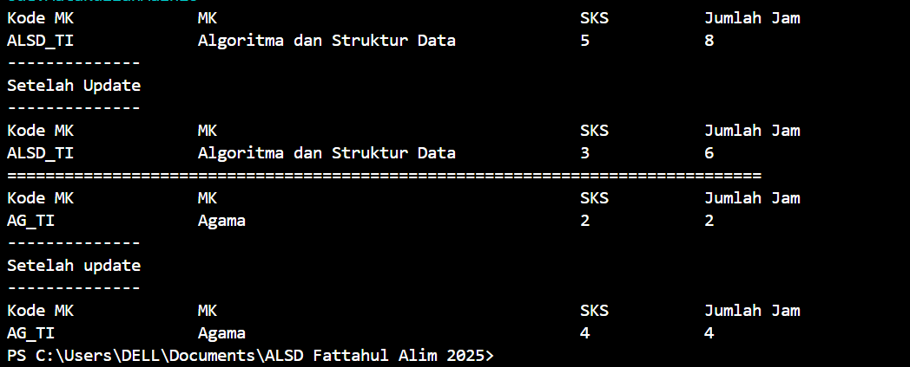
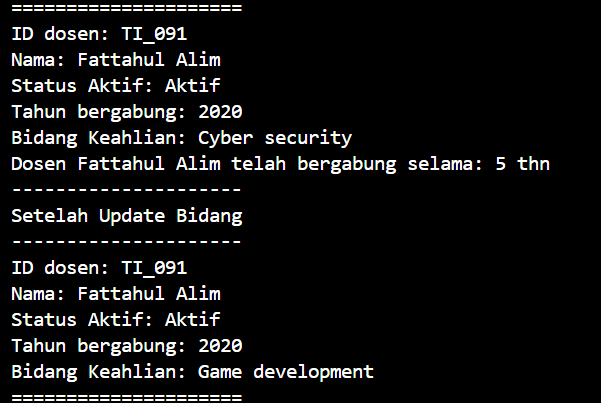

|  | Algoritma dan Struktur Data|
|--|--|
| NIM |  244107020018|
| Nama |  Muhammad Fattahul Alim |
| Kelas | TI - 1H |
| Repository |https://github.com/FattahulAlim/ALSD-Fattahul-Alim-2025|

# Jobsheet 2 Object

## 2.1 Percobaan 1: Deklarasi Class, Atribut dan Method

--- 

### 2.1.3 Pertanyaan
1. Sebutkan 2 karakteristik class atau object 
- Enkapsulasi 

    Enkapsulasi merupakan konsep utama dalam OOP. Konsep ini melibatkan penggabungan data dan metode yang mengoperasikannya menjadi satu unit, biasanya sebuah kelas. Enkapsulasi melindungi data dari modifikasi yang tidak disengaja, meningkatkan organisasi kode, dan menyederhanakan interaksi antara komponen program.

- Pewarisan

    Pewarisan dalam pemrograman berorientasi objek (OOP) adalah konsep yang memungkinkan kelas mewarisi sifat-sifat dari kelas lain. Pewarisan juga dikenal sebagai inheritance

2. Sebutkan atribut yang ada dalam class Mahasiswa
    
    Terdapat 4 atribut yang ada pada class Mahasiswa16 yaitu nama, nim, kelas, dan ipk

3. Berapa method yang dimiliki? sebutkan apa saja!

    Terdapat 4 method yang dimiliki yaitu:
    - tampilkanInformasi()
    - ubahKelas()
    - updateIPK()
    - nilaiKinerja()

4. Mengubah method updateIPK() untuk melakukan pengecekan kondisi

.png)

5. Jelaskan cara kerja method nilaiKinerja()
- method nilaiKinerja() akan melakukan pengecekan awal untuk memeriksa apakah ipk mahasiswa sudah sesuai dengan ketentuan yaitu bernilai diantara 0.0 hingga 4.0 jika tidak sesuai dengan ketentuan akan mengembalikan nilai "IPK tidak Valid. Harus antara 4.0 dan 0.0" dengan tipe data String. Pengecekan kedua dilakukan jika IPK mahasiswa memiliki nilai sesuai dengan ketentuan, program akan melakukan pengecekan nilai mahasiswa dan mengembalikan nilai String sesuai dengan kondisi masing masing. Contoh jika mahasiswa memiliki nilai IPK 3.6 maka akan mengembalikan nilai "Kinerja sangat baik" dengan tipe data string dan seterusnya

## 2.2 Percobaan 2: Instansiasi Object, serta Mengakses Atribut dan Method

---

### 2.1.3 Pertanyaan

1. Tunjukkan baris kode program yang digunakan untuk instansiasi dan nama object yang dihasilkan!
    
        Mahasiswa16 mhs1 = new Mahasiswa16();

    nama object yang dihasilkan dari instansiasi diatas adalah mhs1

2. Bagaimana cara mengakses atribut dan method dari suatu object?
    
    untuk mengakses atribut dari suatu object dapat dilakukan dengan menggunakan syntax {nama object}.atribut = "nilai yang ingin dimasukkan";

    sementara untuk mengakses method dari suatu object dapat dilakukan dengan menggunakan syntax {nama object}.{nama method}(); ini adalah syntax untuk method tanpa parameter, untuk method dengan parameter dapat dilakukan dengan {nama object}.{nama method}(Nilai yang ingin dimasukkan);

3. Mengapa hasil output pemanggilan method tampilkanInformasi() pertama dan kedua berbeda?

    Karena pada pemanggilan method tampilkanInformasi() yang pertama method tersebut akan menampilkan nilai attribut yang telah kita isi di awal. setelah itu kita memanggil method ubahKelas() dan method updateIPK() untuk mengubah nilai attribut kelas dan ipk setelah itu kita memanggil method tampilkanInformasi() untuk yang kedua kali, hal ini menyebabkan tampilan output berubah karena kita telah merubah nilai kelas dan ipk dengan method ubahKelas() dan updateIPK()

## 2.3 Percobaan 3: Membuat Konstruktor

---

### 2.3.3 Pertanyaan
1. Tunjukkan baris kode yang digunakan untuk mendeklarasikan konstruktor berpameter!

            public Mahasiswa16(String nm, String nim, double ipk, String kls) {
        nama = nm;
        this.nim = nim;
        this.ipk = ipk;
        kelas = kls;
         }

2. Apa yang dilakukan pada baris kode berikut:
        
        Mahasiswa16 mhs2 = new Mahasiswa16("Annisa Nabila", "2141720160", 3.25, "TI 2L");

    Baris kode tersebut digunakan untuk melakukan proses instansiasi dan menghasilkan objek dengan nama mhs 2. setelah objek terbentuk attribut akan langsung diakses dan diisi dengan nilai dalam sebuah parameter

3. Apa yang terjadi jika kita menghapus konstruktor default pada class mahasiswa?

    Akan terjadi error seperti gambar dibawah yang menyatakan constructor Mahasiswa16() is undefined yaitu tidak ada konstruktor default yang didefiniskan didalam class Mahasiswa16()
---
.png)
---

4. Apakah method di dalam class Mahasiswa16 harus diakses secara berurutan?

    Tidak, method di dalam class Mahasiswa16 tidak harus diakses secara berurutan kita bisa mengakses method dengan tidak berurutan tergantung dengan apa kebutuhan kita

5. buat objek baru dengan nama mhs{NamaMahasiswa} menggunakan konstruktor berparameter!
---
.png)
---
---
.png)
---

## 2.4 Latihan Praktikum

### No. 1
Membuat program yang mengimplementasikan berdasarkan class diagram dari class Matakuliah berikut hasil outputnya:

---

---

### No. 2
Membuat program yang mengimplementasikan berdasarkan class diagram dari class Dosen berikut hasil outputnya:

---

---
---
.png)
---
