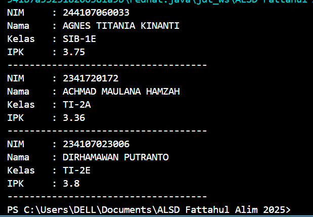

|  | Algoritma dan Struktur Data|
|--|--|
| NIM |  244107020018|
| Nama |  Muhammad Fattahul Alim |
| Kelas | TI - 1H |
| Repository |https://github.com/FattahulAlim/ALSD-Fattahul-Alim-2025|

# Jobsheet 3 Array of objects

## 3.2 Membuat Array dari object, Mengisi dan Menampilkan

---

### 3.2.3 Pertanyaan
1. apakah class yang akan dibuat array of object harus selalu memiliki atribut dan sekaligus method?

    Tidak, class tidak harus selalu memiliki keduanya ada kondisi dimana class akan memiliki atribut saja atau method saja.

2. Apa yang dilakukan oleh kode program berikut?
        
        Mahasiswa16[] arrayOfMahasiswa = new Mahasiswa16[3];

    kode program diatas digunakan untuk melakukan instansiasi array serta kapasitas array yang nantinya akan digunakan sebagai wadah untuk menyimpan objek dari class Mahasiswa16

3. Apakah class mahasiswa memiliki konstruktor? jika tidak kenapa bisa dilakukan pemanggilan konstruktor pada baris program berikut?

        arrayOfMahasiswa[0] = new Mahasiswa16();
        

    dapat dilakukan pemanggilan konstruktor karena dalam bahasa pemrograman java jika kita tidak menambahkan konstruktor pada suatu class maka konstruktor tanpa parameter akan menjadi konstruktor default class tersebut sehingga kita dapat melakukan pemanggilan konstruktor untuk instansiasi object

4.  Apa yang dilakukan oleh kode program berikut?

        arrayOfMahasiswa[0] = new Mahasiswa16();
        arrayOfMahasiswa[0].nim = "244107060033";
        arrayOfMahasiswa[0].nama = "AGNES TITANIA KINANTI";
        arrayOfMahasiswa[0].kelas = "SIB-1E";
        arrayOfMahasiswa[0].ipk = (float) 3.75;

    baris pertama dilakukan untuk instansiasi object yang nantinya akan disimpan di dalam array index ke 0, baris setelahnya digunakan untuk mengakses atribut mahasiswa index ke 0 dan mengisinya dengan suatu nilai

5. Class Mahasiswa dan MahasiswaDemo dipisahkan agar kode dapat ditulis dengan lebih rapi yang mengakibatkan kode mudah untuk dipahami dan di maintenance. selain itu pemisahan class dilakukan agar apabila terjadi perubahan class yang memiliki fungsi main tidak akan terlalu banyak terpengaruh

## 3.3 Menerima Input Isian Array Menggunakan looping

---

### 3.3.3 Pertanyaan
1. Tambahkan method cetakInfo() pada class Mahasiswa kemudian modifikasi kode program.

    Method pada class Mahasiswa
.png)

    Kode program yang telah diedit
.png)
---

2. Misalkan anda punya array baru dengan nama myArrayOfMahasiswa mengapa kode tersebut menyebabkan error?

    Kode program akan menyebabkan error jika kita ingin melakukan output pada seluruh isi array sementara array yang diisi hanya pada index ke - 0 hal ini akan menyebabkan runtime error yaitu nullpointerexception disaat program hendak melakukan print pada index setelah 0, karena kita ingin mengakses objek yang belum dibentuk.

## 3.4 Constructor berparameter

---

### 3.4.3 Pertanyaan

1. Apakah suatu class dapat memiliki lebih dari 1 constructor?

    Ya, suatu class dapat memiliki lebih dari 1 constructor berikut contohnya:
.png)

    Pada class MataKuliah16 telah memiliki 2 constructor yaitu constructor berparamater pada baris ke 7 hingga 12 dan constructor tanpa parameter pada baris ke 14 hingga 16

2. Tambahkan method tambahData() pada class Matakuliah

    Perubahan pada class MataKuliah16
.png)

    Perubahan pada class MataKuliahDemo16
.png)

3. Tambahkan method cetakInfo() pada class MataKuliah

    Perubahan pada class MataKuliah16
.png)

    Perubahan pada class MataKuliahDemo16
.png)
    

4. Modifikasi agar panjang array ditentukan oleh pengguna

    Modifikasi kode program
.png)
    
    Hasil output
.png)

## 3.5 Tugas

### Nomor 1

---

### Nomor 2

---
.png)

