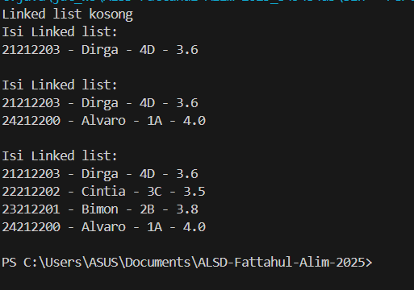
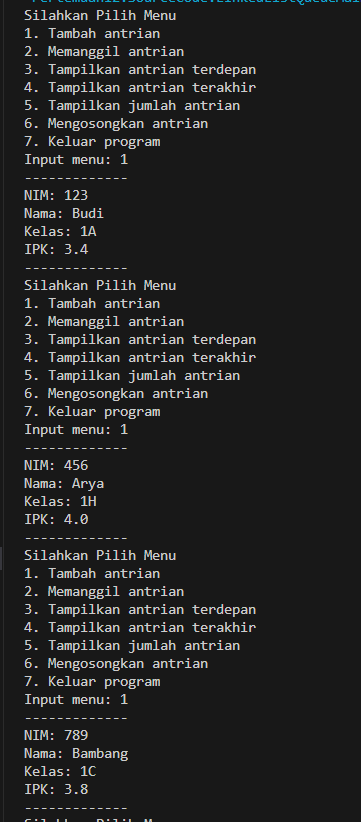

|  | Algoritma dan Struktur Data|
|--|--|
| NIM |  244107020018|
| Nama |  Muhammad Fattahul Alim |
| Kelas | TI - 1H |
| Repository |https://github.com/FattahulAlim/ALSD-Fattahul-Alim-2025|

# Jobsheet 12 Linked List

## 2.1 Pembuatan Single Linked List

Hasil Praktikum :
---

---

### 2.1.2 Pertanyaan

1. Mengapa hasil compile kode program di baris pertama menghasilkan “Linked List Kosong”?

    Karena pada statement baris pertama belum ada linked list yang diisi sehingga menampilkan hasil "Linked List Kosong"

2. Jelaskan kegunaan variable temp secara umum pada setiap method!

    variable temp secara garis besar digunakan untuk melakukan proses traverse yaitu proses melakukan kunjungan pada setiap node tepat satu kali. dengan adanya proses traverse kita dapat melakukan berbagai hal seperti menambah data, menyisipkan data, melakukan print dan lain sebagainya

3. Lakukan modifikasi agar data dapat ditambahkan dari keyboard!

    Perubahan Kode

                Scanner sc = new Scanner(System.in);
        SingleLinkedList16 sll = new SingleLinkedList16();
        
        int pilih;
        String nim, nama, kelas;
        double ipk;

        do{
            System.out.println("Silahkan Pilih Menu");
            System.out.println("1. Tambah Data Diawal");
            System.out.println("2. Tambah data setelah data x");
            System.out.println("3. Tambah data di indeks ke-x");
            System.out.println("4. Tambah data di posisi akhir");
            System.out.println("5. Print linked list");
            System.out.print("Input menu: ");
            pilih = sc.nextInt();
            sc.nextLine();

            switch (pilih) {
                case 1:
                    System.out.println("-------------");
                    System.out.print("NIM: ");
                    nim = sc.nextLine();
                    System.out.print("Nama: ");
                    nama = sc.nextLine();
                    System.out.print("Kelas: ");
                    kelas = sc.nextLine();
                    System.out.print("IPK: ");
                    ipk = sc.nextDouble();

                    Mahasiswa16 mhs1 = new Mahasiswa16(nim, nama, kelas, ipk);
                    sll.addFirst(mhs1);
                    break;
                case 2:
                    System.out.println("-------------");
                    System.out.print("NIM: ");
                    nim = sc.nextLine();
                    System.out.print("Nama: ");
                    nama = sc.nextLine();
                    System.out.print("Kelas: ");
                    kelas = sc.nextLine();
                    System.out.print("IPK: ");
                    ipk = sc.nextDouble();
                    System.out.println("-------");
                    System.out.println("Data ingin diinput setelah ?");
                    System.out.print("Input nama mahasiswa: ");
                    String key = sc.nextLine();
                    System.out.println("-------");

                    Mahasiswa16 mhs2 = new Mahasiswa16(nim, nama, kelas, ipk);
                    sll.insertAfter(key, mhs2);
                    break;
                case 3:
                    System.out.println("-------------");
                    System.out.print("NIM: ");
                    nim = sc.nextLine();
                    System.out.print("Nama: ");
                    nama = sc.nextLine();
                    System.out.print("Kelas: ");
                    kelas = sc.nextLine();
                    System.out.print("IPK: ");
                    ipk = sc.nextDouble();
                    System.out.println("-------");
                    System.out.println("Data ingin diinput indeks berapa ?");
                    System.out.print("Input indeks: ");
                    String indeks = sc.nextLine();
                    System.out.println("-------");

                    Mahasiswa16 mhs3 = new Mahasiswa16(nim, nama, kelas, ipk);
                    sll.insertAfter(indeks, mhs3);
                    break;
                case 4:
                    System.out.println("-------------");
                    System.out.print("NIM: ");
                    nim = sc.nextLine();
                    System.out.print("Nama: ");
                    nama = sc.nextLine();
                    System.out.print("Kelas: ");
                    kelas = sc.nextLine();
                    System.out.print("IPK: ");
                    ipk = sc.nextDouble();

                    Mahasiswa16 mhs4 = new Mahasiswa16(nim, nama, kelas, ipk);
                    sll.addLast(mhs4);
                    break;
                case 5:
                    sll.print();
                    break;
                case 6: 
                    System.out.println("Terima Kasih.");
                    break;
                default:
                    System.out.println("Input invalid");
                    break;
            }
        } while (pilih != 6); 

## 2.2 Modifikasi Elemen pada Single Linked List

Hasil Praktikum :
---

---

### 2.2.3 Pertanyaan

1. Mengapa digunakan keyword break pada fungsi remove? Jelaskan!

    Keyword breal pada fungsi remove digunakan untuk menghentikan perulangan apabila data yang kita cari telah ditemukan dan dihapus guna meminimalisir adanya perulangan yang sia sia.

2. Jelaskan baris kode dibawah pada fungsi remove

                    temp.next = temp.next.next;
                    if (temp.next == null) {
                        tail = temp;
                    }

                    
    Baris kode temp.next = temp.next.next; digunakan untuk menghapus data apabila data yang dicari terletak diantara head dan tail, misal kita ingin mengahapus data x maka temp.next = temp.next.next; digunakan untuk menyambungkan ikatan antara data sebelum x dan setelah x sekaligus menghapus ikatan x terhadap keduanya.

    setelah penghapusan dilakukan pengecekan apakah temp.next bernilai null? jika iya maka tail harus diperbarui dengan menjadikan temp sebagai nilai barunya

## 3. Tugas

Hasil Output:
---

---
.png)
---
.png)
---
.png)
---