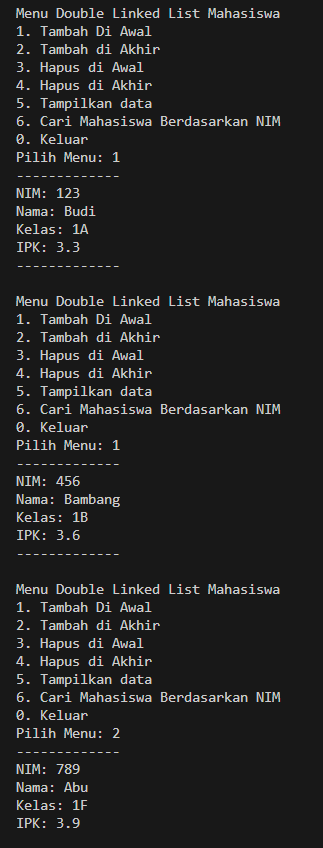
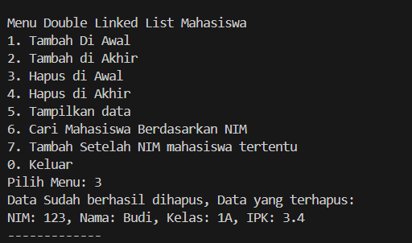
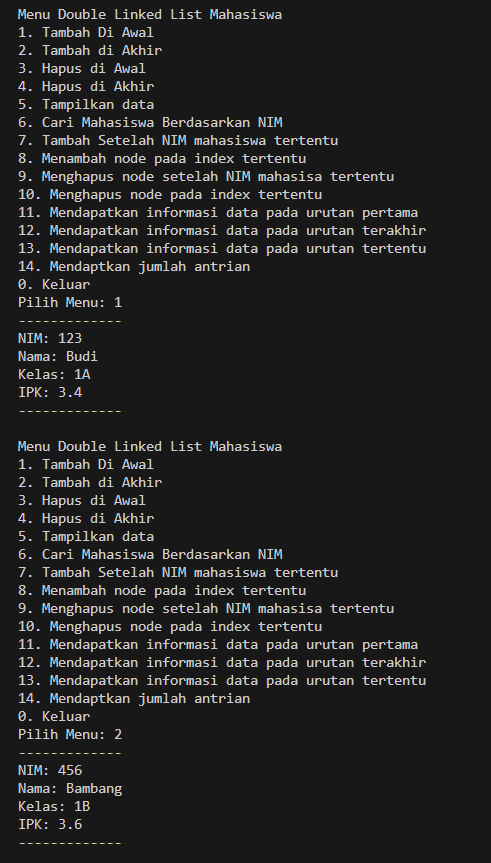

|  | Algoritma dan Struktur Data|
|--|--|
| NIM |  244107020018|
| Nama |  Muhammad Fattahul Alim |
| Kelas | TI - 1H |
| Repository |https://github.com/FattahulAlim/ALSD-Fattahul-Alim-2025|

# Jobsheet Double Linked Lists

## 12.2.1 Percobaan 1

Hasil Praktikum :
---

---
.png)
---
.png)
---

### 12.2.3 Pertanyaan Percobaan

1. Jelaskan perbedaan antara single linked list dengan double linked lists!

    Pada single linked list setiap node hanya memiliki atribut next yang berarti apabila kita ingin mengakses linked list tersebut kita hanya bisa mengakses node satu per satu dari depan ke belakang, sementara pada double linked list terdapat atribut next dan prev pada tiap node sehingga kita dapat mengakses node pada double linked list dari depan ke belakang ataupun dari belakang ke depan

2. Perhatikan class Node01, di dalamnya terdapat atribut next dan prev. Untuk apakah
atribut tersebut?

    Atribut next dapat digunakan untuk mengakses node setelahnya, sementara atribut prev dapat digunakan untuk mengakses node sebelumnya.

3. Apa kegunaan dari konstruktor berikut

        public DoubleLinkedList01() {
        this.head = null;
        this.tail = null;
        }

    Konstruktor diatas digunakan untuk menginisialisasi nilai head dan tail menjadi null agar kita dapat meletakkan node sesuai pada tempat yang diinginkan

4. Pada method addFirst(), apa maksud dari kode berikut?

        if (isEmpty()) {
        head = tail = newNode;
        }

    Maksud dari kode tersebut adalah apabila kita ingin menambahkan node baru dalam kondisi linked list yang masih kosong maka node baru tersebut akan otomatis menjadi head sekaligus tail dari linked list tersebut. 

5. Perhatikan pada method addFirst(). Apakah arti statement head.prev = newNode ?

    Fungsi method addFirst adalah untuk menambahkan node baru di awal list, maka untuk merealisasikan hal tersebut kita harus menghubungkan newNode dengan head yang sekarang. saat ini head.prev masih bernilai null maka kita gunakan kode nilai head.prev = newNode untuk menghubungkan head.prev dengan newNode. Maka sekarang nilai prev head menjadi newNode dan head telah mengetahui bahwa newNode terletak di node sebelum head.

6. Modifikasi code pada fungsi print() agar dapat menampilkan warning/ pesan bahwa
linked lists masih dalam kondisi.

    Modifikasi kode program :

        public void print() {
            Node01 current = head;
            if (isEmpty()) {
                System.out.println("Linked list kosong.");
            } else {
                while (current != null) {
                    current.data.tampil();
                    current = current.next;
                }
            }

        }

7.  Pada insertAfter(), apa maksud dari kode berikut ?

        current.next.prev = newNode;

    insertAfter() adalah method untuk menyisipkan nilai node baru diantara node node yang telah buat, untuk menyisipkan node baru diantara node yang lain maka kita perlu memperbarui pointer prev di node setelah current menunjuk newNode dapat yang baru saja disisipkan.

8. Modifikasi menu pilihan dan switch-case agar fungsi insertAfter() masuk ke dalam menu
pilihan dan dapat berjalan dengan baik.

    Beberapa titik perubahan: 

                    do {
            System.out.println("\nMenu Double Linked List Mahasiswa");
            System.out.println("1. Tambah Di Awal");
            System.out.println("2. Tambah di Akhir");
            System.out.println("3. Hapus di Awal");
            System.out.println("4. Hapus di Akhir");
            System.out.println("5. Tampilkan data");
            System.out.println("6. Cari Mahasiswa Berdasarkan NIM");
            System.out.println("7. Tambah Setelah NIM mahasiswa tertentu");
            System.out.println("0. Keluar");
            System.out.print("Pilih Menu: ");
            pilihan = sc.nextInt();
            sc.nextLine();
---

                        case 7:
                    System.out.println("-------------");
                    System.out.print("NIM: ");
                    nim = sc.nextLine();
                    System.out.print("Nama: ");
                    nama = sc.nextLine();
                    System.out.print("Kelas: ");
                    kelas = sc.nextLine();
                    System.out.print("IPK: ");
                    ipk = sc.nextDouble();
                    sc.nextLine();

                    Mahasiswa01 mhs2 = new Mahasiswa01(nim, nama, kelas, ipk);
                    System.out.print("Setelah NIM berapa data mahasiswa ingin diinputkan: ");
                    String afterNIM = sc.nextLine();
                    list.insertAfter(afterNIM, mhs2);
                    break;
---

Hasil Modifikasi
---
.png)
---
.png)

## 12.3 Kegiatan Praktikum 2

Hasil Praktikum :
---

---
.png)
---
.png)
---

### 12.3.3 Pertanyaan Percobaan

1. Apakah maksud statement berikut pada method removeFirst()?

        head = head.next;
        head.prev = null;

    Untuk menghapus node paling awal maka kita perlu memindahkan head terlebih dahulu ke head.next barulah kita bisa menghapus node paling awal dengan aman menggunakan perintah head.prev = null agar menghilangkan akses head.prev sehingga head.prev sudah tidak dapat diakses lagi dan menjadi terhapus yang nantinya akan dibersihkan oleh java garbage collector

2. Modifikasi kode program untuk menampilkan pesan “Data sudah berhasil dihapus.
Data yang terhapus adalah … “

Modifikasi kode program: 
---
    public void deleteFirst() {
        Node01 temp = head;
        if (isEmpty()) {
            System.out.println("Linked List Kosong");
        } else if (head.next == null) {
            // jika node yang telah diisi hanya satu
            head = null;
            tail = null;
            System.out.println("Data Sudah berhasil dihapus, Data yang terhapus: ");
            temp.data.tampil();
        } else {
            head = head.next;
            head.prev = null;
            System.out.println("Data Sudah berhasil dihapus, Data yang terhapus: ");
            temp.data.tampil();
        }
    }

    public void deleteLast() {
        Node01 temp = tail;
        if (isEmpty()) {
            System.out.println("Linked List Kosong");
        } else if (tail.prev == null) {
            head = null;
            tail = null;
            System.out.println("Data Sudah berhasil dihapus, Data yang terhapus: ");
            temp.data.tampil();
        } else {
            tail = tail.prev;
            tail.next = null;
            System.out.println("Data Sudah berhasil dihapus, Data yang terhapus: ");
            temp.data.tampil();
        }
    }

Hasil Output :
---

## 12.5 Tugas Praktikum

Hasil Tugas :
---

---
.png)
---
.png)
---
.png)
---
.png)
---

