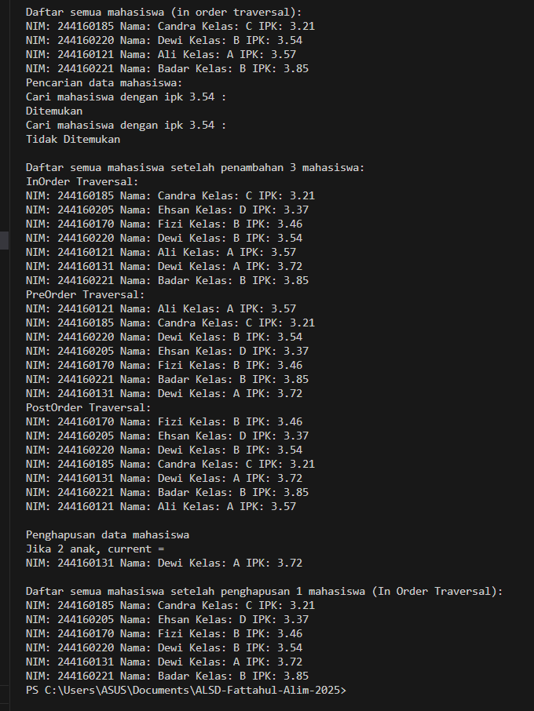
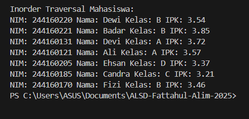
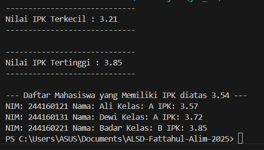

|  | Algoritma dan Struktur Data|
|--|--|
| NIM |  244107020018|
| Nama |  Muhammad Fattahul Alim |
| Kelas | TI - 1H |
| Repository |https://github.com/FattahulAlim/ALSD-Fattahul-Alim-2025|

# Jobsheet Tree

## 14.2.1 Percobaan 1 

Hasil Praktikum :
---

### 14.2.2 Pertanyaan Percobaan

1. Mengapa dalam binary search tree proses pencarian data bisa lebih efektif dilakukan dibanding
binary tree biasa?

    Karena dalam binary search tree terdapat aturan dalam penempatan data yaitu nilai data pada node kiri harus lebih kecil dibandingkan dengan nilai data pada node kanan sehingga kita dapat melakukan proses pencarian data lebih efektif karena data dalam binary search tree sudah terurut sementara data dalam binary tree biasa belum terurut karena tidak adanya aturan penempatan tersebut

2. Untuk apakah di class Node, kegunaan dari atribut left dan right?

    Kegunaan dari atribut left dan right pada class node adalah untuk menyimpan refernsi data ke node anak yang ada di sebelah kiri dan kanan. atribut right digunakan untuk menunjuk node anak kanan sementara atribut left digunakan untuk menunjuk node anak kiri pada tree

3. a. Untuk apakah kegunaan dari atribut root di dalam class BinaryTree?

    b. Ketika objek tree pertama kali dibuat, apakah nilai dari root? 

    A. Atribut rood pada class binary tree digunakan untuk menyimpan referensi ke node utama sehingga nantinya kita dapat mengakses keseluruhan data yang ada dalam tree yang dimulai dari node root sebagai node utamanya
    
    B. Ketika objek tree pertama kali dibuat root akan bernilai null karena belum ada data yang ditambahkan ke dalam tree, hanya objek tree nya saja yang sudah dibuat. Sementara node root belum diisi, bisa dilihat dari constructor yang telah dibuat yaitu :

        public BinaryTree16(){
        root = null;
        }

4. Ketika tree masih kosong, dan akan ditambahkan sebuah node baru, proses apa yang akan terjadi?

    Ketika tree masih kosong dan akan ditambahkan node baru maka hal pertama yang dapat kita lakukan adalah memanggil method add pada class tree nantinya pada method add akan dibuat objek baru bernama newNode yang akan disimpan di class node setelah itu dilakukan pengecekan kondisi dengan memanggil fungsi isEmpty() karena tree masih kosong maka isEmpty() akan mengembalikan nilai true karena nilai root sama dengan null setelah pengecekan kondisi dilakukan maka akan mengeksekusi baris selanjutnya yaitu mengubah referensi node root yang awalnya null menjadi nilai yang ada pada newNode

        public void add(Mahasiswa16 mahasiswa){
        Node16 newNode = new Node16(mahasiswa);
        if (isEmpty()) {
            root = newNode;

5. Perhatikan method add(), di dalamnya terdapat baris program seperti di bawah ini. Jelaskan
secara detil untuk apa baris program tersebut?

                        parent = current;
                if (mahasiswa.ipk < current.mahasiswa.ipk) {
                    current = current.left;
                    if (current == null) {
                        parent.left = newNode;
                        return;
                    }
                } else {
                    current = current.right;
                    if (current == null) {
                        parent.right = newNode;
                        return;
                    }
                }

    Baris pertama akan digunakan untuk menyimpan node saat ini yaitu  current kedalam parent lalu dilakukan pengecekan kondisi apakah nilai ipk mahasiswa baru lebih kecil jika iya maka data baru akan dipindahkan ke anak kiri dan jika anak kiri kosong maka node baru akan diletakkan di posisi tersebut

    Sebaliknya jika nilai ipk mahasiswa yang baru lebih besar atau sama dari current maka current akan pindah ke anak kanan lalu dilakukan pengecekan kondisi apakah posisi saat ini kosong jika iya maka node baru akan diletakkan di posisi tersebut

6.  Jelaskan langkah-langkah pada method delete() saat menghapus sebuah node yang memiliki dua
anak. Bagaimana method getSuccessor() membantu dalam proses ini?

    Langkah pertama adalah memanggil method getSuccessor() untuk mencari pengganti (successor) dari node yang akan dihapus. Setelah itu, successor akan ditempatkan di posisi node yang dihapus, Lalu menghubungkan kembali anak kiri dan anak kanan dari node yang dihapus ke successor, agar struktur tree tetap utuh dan valid sesuai aturan Binary Search Tree.

    Method getSuccessor() sendiri akan membantu dalam penghapusan node yang memiliki dua anak untuk mencari nilai terkecil dari subtree kanan yang merupakan kandidat terbaik untuk menggantikan node yang dihapus agar aturan binary tree tetap terpenuhi.  setelah itu melakukan cek kondisi apabila successor bukan anak langsung node yang akan dihapus maka successorParent.left akan diarahkan ke successor.right untuk menjaga struktur tree tetap tersambung. Terakhir, anak kanan dari node yang dihapus del.right akan dihubungkan ke successor.right.

## 14.3 Kegiatan Praktikum 2

Hasil Praktikum
---

### 14.3.2 Pertanyaan Percobaan

1. Apakah kegunaan dari atribut data dan idxLast yang ada di class BinaryTreeArray?

    Atribut dataMahasiswa digunakan untuk menyimpan semua data yang masuk ke dalam tree dalam bentuk array sedangkan idxLast digunakan untuk menyimpan index terakhir yang digunakan dalam dataMahasiswa digunakan untuk membatasi transversal agar tidak keluar dari batas array

2.  Apakah kegunaan dari method populateData()?

    Populate data digunakan untuk mengisi atribut tree dengan data yang telah diinputkan oleh user yaitu data mahasiswa dan index terakhir yang digunakan dalam array

3. Apakah kegunaan dari method traverseInOrder()?

    method travesreInOrder() digunakan untuk mengakses seluruh isi tree dengan transversal menggunakan aturan in order yaitu dengan pola anak kiri -> node saat ini -> anak kanan

4. Jika suatu node binary tree disimpan dalam array indeks 2, maka di indeks berapakah posisi
left child dan rigth child masing-masing?

    Apabila root dimulai dari index 0 maka anak kiri dari node index 2 tersebut terletak pada index 5 (2 * i + 1) dan anak kanan terletak pada index 6 (2 * i + 2)

    Apabila root dimulai dari index 1 maka anak kiri dari node index 2 terletak di index 4 (2 * i) dan anak kanan terletak pada index 5 (2 * i + 1) 

5.  Apa kegunaan statement int idxLast = 6 pada praktikum 2 percobaan nomor 4?

    int idxLast = 6 digunakan untuk menentukan index terakhir dari elemen yang berisi data pada array dataMahasiswa, nantinya nilai ini akan dikirim sebagai parameter method populateData() untuk mengisi atribut idxLast di clas binary tree untuk digunakan sebagai batas akhir traversal agar traversal tidak keluar dari batas array.

6. Mengapa indeks 2 * idxstart + 1 dan 2 * idxStart + 2 digunakan dalam pemanggilan
rekursif, dan apa kaitannya dengan struktur pohon biner yang disusun dalam array

     2 * idxStart + 1 (rumus posisi anak kiri) dan 2 * idxStart + 2 (rumus posisi anak kanan) digunakan dalam pemanggilan rekursif karena itu merupakan rumus untuk mengetahui posisi anak kiri dan anak kanan dari sebuah tree berbentuk array. nantinya rumus tersebut digunakan untuk melakukan proses print data pada tree secara in order sehingga urutannya dari anak kiri -> node saat ini -> anak kanan

## 14.4 Tugas Praktikum

Hasil Praktikum :
---

---
.png)

